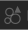
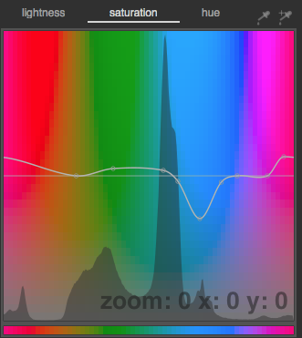

# Darktable Sony A6300 Style

A style to apply to raw files from Sony A6300 in Darktable.
[Darktable](https://www.darktable.org/) is an open source photography workflow application and raw developer.

Although darktable features a base curve for "Sony Alpha like" comera's. I wasn't satisfied with the
outcome in the standard darktable processing.

I changed the setting for "highlight reconstruction". The standard setting of this module
"clip highlights" sometimes results in strange colors in highlights, like e.g. the sky.
Even with the setting "reconstruct in LCh" which produces better results I find certain colors like cyan to be 
to dominant. So I corrected that in "Color zones". I also bumped up the red a bit. 

I added some extra saturation in the "contrast brightness saturation" module.

Lastly I enabled lens correction.

## Import

In lighttable view in "styles" use "import" to import the "ILCE-6300.dtstyle" file.

## Use

### Bulk

Just select the images in lighttable, choose the "Sony-ILCE-6300" in the "styles" module and click apply.

### Individual images

In darkroom view. Just click on the  to the lower left side of the image and choose the "Sony-ILCE-6300" style.

## Processing steps

* contrast brightness saturation: saturation + 0.1
* color zones: 
* highlight reconstruction: reconstruct in LCh
* lens correction: enabled (it should automatically choose the lens based on raw metadata)

